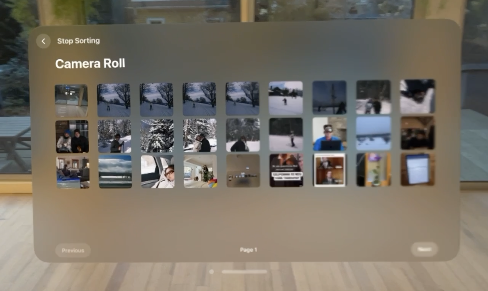
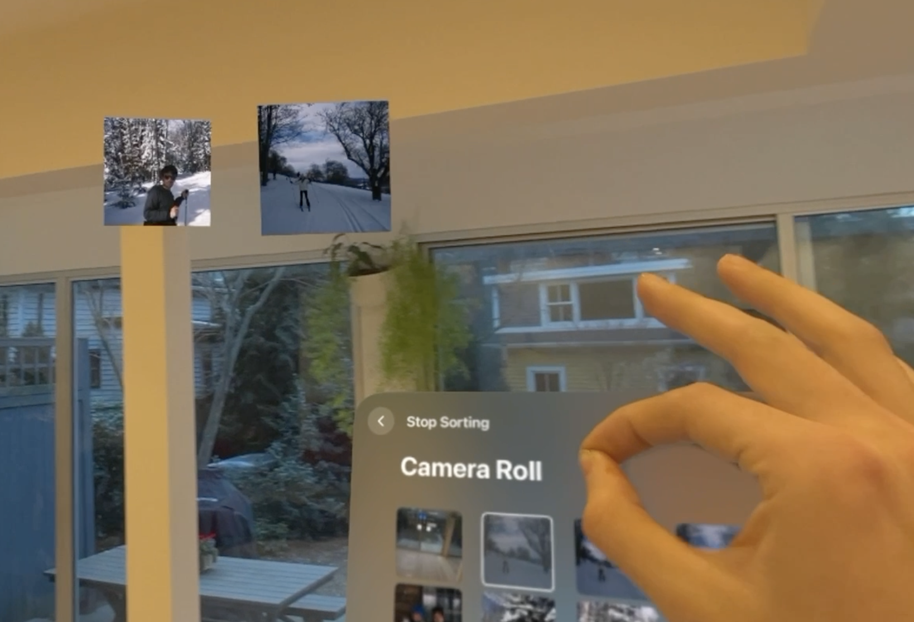

# Photo Finder

[](https://www.youtube.com/watch?v=waE4bINAIMQ)

https://alexbrodriguez.notion.site/Photo-Finder-da418e2ac6be447a90a754ab67247394?pvs=4

# Project Goal

Photo Finder is all about enabling the user to leverage the full power of immersive spaces to organize, layout, and sort their photos. When I first used the native photos app on the vision pro, I felt like it’s single window UI focused on porting the iPhone/iPad photos app to the new platform instead of redefining new interactions and design principles. 

### Real World Analog:

Anyone who has an old box of photos in an attic or basement somewhere around their house knows the feeling of bringing the box out into the living room and sifting through all the old photos as you lay them across the floor. In doing this, you get a higher level view of all your photos than if you’re just scrolling through a single screen of photos. The goal of Photo Finder is to **recreate the living room experience in the Vision Pro**

### Key Features:

- Users should be able to scroll through all of their old photos just like they can in the native app.
- If a user wants to save / organize a photo, they need to be able to bring it out of the scroll window into their 3D space. They should be able to place it anywhere in space
- Users should be able to stack photos to form piles that can propagate into albums in their photos app
- Users should be able to throw photos in the trash to mark them for deletion later

# Design Process

The first component of the app, the grid view of your photos is the most default component of the app. Here a simple WindowGroup works perfectly to give a single grid of all of your photos



Next, we have to consider how we want to represent photos when they are pulled out of grid



The intuitive first choice might be to just create a window for each photo since they are just 2D planes in space. However this conflicts with one of the core principles I designed this app with:

### Seamless transitioning between Windows and Entities

I knew when I built this app, I wanted to create the effect of pulling pictures directly out of the grid window and pin them anywhere in your 3D space. 

If you create a window or volume for each photo as you pull it into space, you can easily manipulate and move the image in 3D space. However, you run into two problems:

1. The OS won’t let you programmatically move or position window objects
2. Detecting collisions of windows or volumes is not very accessible

The solution to this problem is then to use an Immersive Space around the window and create RealityKit entities for each picture in 3D space. This introduces two main programming problems you then have to handle manually:

1. When the user drags a UIImage in the camera roll, you need to convert the SwiftUI view’s coordinates into the immersive space **(vision OS 1.1 beta played a key role here)** to be able to position the entities in immersive space right on top of the UIImage in the swift view
2. Mimic the native window effect of always facing the user such that any movement of the picture entities rotates them correctly to face the user.

To accomplish problem 1, you wrap the UIImage in a Geometry3DReader  and apply it’s proxy’s transform to the point in swift UI space. This gives a point in the immersive space that you can then convert via physicalMetrics conversion into the units necessary to position the realityKit entity. I then pass the new position along with the selection entity to my picture manager which is the part of my view model which maintains picture state.

```swift
if let transform = proxy.transform(in: .named(ViewModel.pictureSpace)) {
      let point = SIMD4<Double>(
          value.location3D.x,
          value.location3D.y,
          value.location3D.z+inFrontAdjustment,
          1
      )
      // Apply the affine transformation
      let tP = transform.matrix * point
      var outPoint = SIMD3<Float>(physicalMetrics.convert(Point3D(
          x: tP.x,
          y: tP.y,
          z: tP.z), to: .meters))
      
      outPoint.x = outPoint.x / Float(transform.scale.width)
      outPoint.y = outPoint.y / Float(-1*transform.scale.height)
      outPoint.z = outPoint.z / Float(transform.scale.depth)
     
      model.pictureManager.updateLoc(entity: picEntity, newPos: outPoint)

}
```

To accomplish problem 2, every time you update the position of an entity, you calculate a new quaternion for it’s orientation based off of the new position, current quaternion, and the device location. Here, ARKit WorldTracking enables you to keep track of the device position at all time. 

From here, we calculate the normalized vector from the device position to the new position of the entity. We can use to this calculate angle between the current normal vector of the plane and the vector facing the device. 

However, we also want to ensure that our picture entity is rotated roll free such that picture’s orientation always aligned with the horizon.

To do this, we can calculate horizontal component of our device to entity vector and measure the quaternion necessary to rotate yaw-wise to get from the current forward normal position to the desired horizontal direction.

Then, we calculate the yaw rotation necessary to get from our horizontal rotation to the end orientation facing the device to entity position vector. 

We multiply these quaternions and we have our final desired rotation.

```swift
func rotationToFaceDevice(newPos: SIMD3<Float>, curQuat: simd_quatf) -> simd_quatf {
    let devPos = deviceManager.getDeviceLocation()
        
    // Calculate direction vector from the entity to the device
    let direction = normalize(devPos - newPos)
    
    // Calculate horizontal component of the direction (for yaw)
    let horizontalDirection = normalize(SIMD3<Float>(direction.x, 0, direction.z))
    
    // Assuming the entity's forward vector is the negative Z-axis in its local space
    let globalForward = SIMD3<Float>(0, 0, 1)
    
    // Calculate yaw rotation (around Y-axis) to face the device horizontally
    let yawRotation = simd_quatf(from: globalForward, to: horizontalDirection)
    
    // Calculate pitch rotation (around the entity's local X-axis) to tilt up or down towards the device's elevation
    // First, transform global forward vector by yaw rotation to align it with horizontal direction
    let alignedForward = yawRotation.act(globalForward)
    
    // Then, calculate quaternion that rotates alignedForward to the actual direction vector
    let pitchRotation = simd_quatf(from: alignedForward, to: direction)
    
    // Combine yaw and pitch rotations
    // Note: This assumes yawRotation already aligns the entity's forward direction with the horizontal projection
    // of the direction vector. The pitchRotation then adjusts the tilt up or down.
    let combinedRotation = pitchRotation * yawRotation
    
    return combinedRotation
}
```

And just like that, we have picture entities we can seamlessly drag straight out of the window and position anywhere we want in 3D space, always facing us

[PhotoFinder Drag Movement Demo.mp4](README_ASSETS/PhotoFinder_Drag_Movement_Demo.mp4)

# Efficient Loading from Photo Library

Another key feature this app needs is to give you full access to your camera roll in real time. However, this means optimizing for both image loading speed and memory constraints.

You want any photo in your camera roll to be immediately available, but, at the same time, you do not want to store a full resolution version of every image in the app’s memory. 

To avoid doing this, we will start out by having 3 image quality tiers. My app is all built around the following `NamedImage` class:

```swift
class NamedImage {
    public var asset: PHAsset
    public var uiImage: UIImage?
    public var imageQuality: ImageQuality
		// ... Rest of the class with properties and functions for other features... 
}
```

This Named image keeps track of the `PHAsset` it queries from in the Photos framework along with an optional UIImage and a custom enum called `ImageQuality`

```swift
enum ImageQuality: Int {
    case empty = 0
    case low = 1
    case high = 2
}
```

As you can see, there are three values for image quality.

- Empty will be the default when a `NamedImage` has an `PHAsset,`but has not yet requested it from the `PHImageManager`, this means `uiImage` is still nil
- Low is a first pass image we will use to populate the camera roll window at first
- High is the full resolution we will load in a second pass and ultimately use to make the texture of the `PictureEntity` in space

From here, we are ready to begin filling out our View Model

```swift
class ViewModel: ObservableObject {
   
  @Published var cameraRoll: [NamedImage] = []
  let photosQueue = DispatchQueue(label: "com.photofinder.photosQueue")
  var unloadedAssetQueue: [PHAsset] = []

	//... rest of View Model ...
```

As you can see our View Model has just 3 simple variables for maintaining the camera roll state. The first is just an array of `[NamedImages]` we are using in our app. Second is a serial DispatchQueue we will use to make sure that modifying the images in the cameraRoll is done in a critical section so that we avoid race conditions when fetching photos at different resolutions in multiple threads. Finally, we store all unused PHAssets that we fetch from our `PHAssetCollection` in `unloadedAssetQueue` so that we can use them to make  `NamedImages` later in the app.

 

From here, we are ready to implement the main method that SwiftUI views will call to access photos from the camera roll. `getCameraRollPage` will take in a start index and an end index that represent the range of images from the page the SwiftUI view is currently looking at. 

```swift
func getCameraRollPage(start: Int, initialEnd: Int) {
      if start < 0 || start > initialEnd {
          return
      }
      
      let pageSize = initialEnd-start
      if initialEnd+pageSize > self.cameraRoll.count { //Want to generate one extra page of images if needed
          generateNamedImages(until: initialEnd+pageSize) 
					//Generate empty NamedImages from our unloadedAssetQueue
					//To then load at the desired resolutions in the following steps
      }
      
      var end = initialEnd
      if self.cameraRoll.count < end {
          end = self.cameraRoll.count
      }
      
      // Low quality render first pass
      renderImageSet(images: self.cameraRoll[start..<end], quality: .low)
      renderImageSet(images: self.cameraRoll[end..<end+pageSize], quality: .low)
      
      // High quality render second pass
      renderImageSet(images: self.cameraRoll[start..<end], quality: .high)
      renderImageSet(images: self.cameraRoll[end..<end+pageSize], quality: .high)
      
      //Remove all images of before 4 pages or after 4 pages to save memory
      let removalLowerBound = start-(pageSize*4)
      if removalLowerBound > 0 {
          renderImageSet(images: self.cameraRoll[0..<removalLowerBound], quality: .empty)
      }

			let removalUpperBound = end+(pageSize*4)
      if removalUpperBound < self.cameraRoll.count{
          renderImageSet(images: self.cameraRoll[removalUpperBound..<self.cameraRoll.count], quality: .empty)
      }
 }
```

After handling edge cases, the first thing this function does is check to see whether the ViewModel `cameraRoll` has enough images to load those that correspond the requested range between start and end. If that isn’t the case, we use a helper function `generateNamedImages` to add enough empty `NamedImages` with assets from the `unloadedAssetsQueue` to our cameraRoll 

After this, we adjust the end of the range to be the minimum of the requested end and the size of the camera roll in case there weren’t enough assets in the queue to fill the range.

From here, we apply our loading algorithm with sequential calls of `renderImageSet`  which will make asynchronous calls to request each NamedImage’s PHAssets from the desired slice as a UIImage

**Our algorithm is as follows:**

1. Dispatch requests for the current page in low quality
2. Dispatch requests for the next page in low quality (In case you are paging through quickly we want to pre-generate the next page in low quality so you do not get a blank page)
3. Dispatch requests for the current page in high quality
4. Dispatch requests for the next page in high quality 
5. Empty out the named images for any images more than 4 pages behind or after the current page. This preserves memory so if you scroll to the 100th page of your camera roll, we are not storing all 100 * pageSize images from your camera roll in memory

With this higher level algorithm, we can take one step deeper into the actual `renderImageSet` which dispatches async calls:

```swift
func renderImageSet(images: ArraySlice<NamedImage>, quality: ImageQuality) {
  if quality == .empty { // Empty out photos from previous pages, but ONLY if they are in the camera roll space
      for img in images {
          img.imageQuality = .empty
          img.uiImage = nil
      }
      return
  }
  
  let manager = PHImageManager.default()
  let options = PHImageRequestOptions()
  options.isSynchronous = false // Set to false to allow asynchronous requests
  options.isNetworkAccessAllowed = true
  
  options.deliveryMode = .fastFormat
  if quality == .high {
      options.deliveryMode = .highQualityFormat
  }
  
  for namedImage in images {
      if namedImage.imageQuality.rawValue >= quality.rawValue { //If the photo is already loaded at the desired quality or better, don't make a call to load to write it
          continue
      }
      manager.requestImage(for: namedImage.asset, targetSize: PHImageManagerMaximumSize, contentMode: .aspectFill, options: options) { (result, info) in
          self.photosQueue.async { //protects serial writing to the images array
              if let uiImage = result && quality > namedImage.quality {
                  DispatchQueue.main.sync { //Should only modify photos in main thread
                      namedImage.imageQuality = quality
                      namedImage.uiImage = uiImage
                  }
              }
          }
      }
  }
  
}
```

The first thing this function does is if the requested quality is `.empty`, all we need to do is remove the `UIImages` from all of the `NamedImages` in the range to save space and return 

Next we create a `PHImageManager` which we will configure with options to allow asynchronous requests and to download from iCloud. We want it to download from iCloud because likely the majority of your photos are on your iPhone so we want to make sure we can bring them into your vision pro app for organization. From here, we then configure the `deliveryMode` of the `PHImageRequestOptions` depending on whether we are doing a low or high resolution pass.

From here, we iterate through every  `namedImage` in the specified range. 

If that `namedImage` already has a`UIImage` with the requested quality or better, we skip to save the cost of having to re-request it from the camera Roll.

Otherwise, we make a asynchronous request to the `PHImageManager` to get the `UIImage` corresponding to our `PHAsset`. 

In our completion closure, we asynchronously add a `DispatchWorkItem` to our custom `photosQueue`. Adding this task to our serial queue ensures that we do not have race conditions if a low pass and a high pass fetch of an image are returning at the same time. This way, only one thread can modify a photo in the camera roll at any given time. This provides thread safety while still offering high performance because the majority of the workload is in the requestImage function, not the completion closure

Within this task, we then add a `DispatchWorkItem` to actually modify the `NamedImage` to the `DispatchQueue.main` queue because we are updating `@Published` properties to our views and need to do so from within the main thread.

 

However, we make this call synchronous such that it blocks within the `photosQueue` task to take advantage of the `photosQueue` ensuring serial access of the cameraRoll array.

In this way, we have thread safe, memory efficient, asynchronous system for pulling all of the photos from your camera roll in a two pass process.

# Future Next Steps

My long term vision for this app is to integrate with FaceTime SharePlay to allow multiple people to lay out their images in a shared context. Through this shared context, I would want to integrate with AirDrop or Shared Albums to be able to share photos in piles in the shared context with every user using the app together at that time.